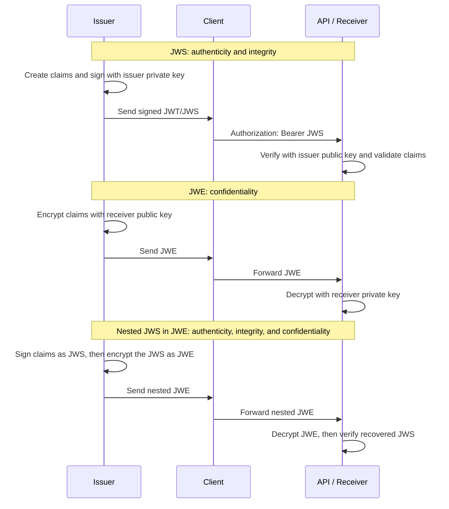

# JWT Creator

A small Node.js example that creates and validates ES256 JSON Web Tokens (JWTs) with the [`jose`](https://www.npmjs.com/package/jose) library.

## Prerequisites

- Node.js 18 or later
- npm

## Install

```powershell
npm install
```

## Create keys

Generate a local ES256 key pair before generating or validating tokens:

```powershell
node .\create-keys.js
```

This writes two key pairs:

- `keys/private.jwk.json` and `keys/public.jwk.json` for ES256 signing and signature verification.
- `keys/encryption-private.jwk.json` and `keys/encryption-public.jwk.json` for RSA-OAEP-256 encryption and decryption.

The example scripts load these files, so they use the same key pairs even when run in separate processes.

### Why two keys?

ES256 uses asymmetric cryptography: the private JWK signs tokens and must remain secret, while the matching public JWK verifies signatures and can be distributed to token consumers. This lets a consumer trust tokens issued by this application without also gaining the ability to create valid tokens.

A JWK is only a JSON representation of cryptographic key material. Although JWK files can be created directly, their values must form a valid related key pair. Generating the pair with a cryptographic library and exporting each key as a JWK safely creates that relationship; manually choosing fields such as the EC public coordinates `x` and `y` is not secure or practical.

## JWT, JWS, and JWE

These terms describe different parts of a token design. They are related, but they are not interchangeable.

| Term | Purpose | Protection | Typical compact form |
| --- | --- | --- | --- |
| JWT (JSON Web Token) | Carries a set of claims, such as who issued the token, its intended audience, and its expiration. | JWT by itself does not require signing or encryption. | Depends on how it is secured. |
| JWS (JSON Web Signature) | Signs content, commonly a JWT. | Integrity and issuer authenticity. Anyone holding the token can still decode its claims. | Three dot-separated parts: `header.payload.signature` |
| JWE (JSON Web Encryption) | Encrypts content, which may be a JWT or JWS. | Confidentiality: only the intended recipient can decrypt the content. | Five dot-separated parts: `header.encryptedKey.iv.ciphertext.tag` |

This project creates a **JWT secured as a JWS**: the claims are JSON, encoded into a JWT payload, then signed with the ES256 private key. The receiver verifies that signature with the corresponding public key. It is therefore tamper-evident, but not secret; do not put passwords, access secrets, or other sensitive data in its claims.

### Practical issuer/receiver guide

1. **Issuer: create claims.** An identity provider creates a JWT containing claims such as `iss`, `aud`, `sub`, `iat`, and `exp`. For example, `https://idp.example.com` issues a short-lived token for `user@example.com` to call `https://api.example.com`.
2. **Issuer: sign as JWS.** The issuer signs the JWT with its private ES256 JWK. It sends the resulting JWS to the client, which presents it to the API in an `Authorization: Bearer <token>` header.
3. **Receiver: verify before trusting.** The API obtains the issuer's public key, verifies the JWS signature, then checks `iss`, `aud`, and time-based claims such as `exp`. Only then should it authorize the subject or roles in the payload.
4. **Use JWE when claims must be private from the token holder or intermediaries.** The issuer encrypts the JWT or signed JWS using the receiver's public encryption key. The receiver decrypts it with its private key; when the contents were also signed, it then verifies the inner JWS before trusting them.

For most API access tokens, a signed JWT/JWS is sufficient because the client is allowed to read its own claims. Add JWE when the claims themselves need confidentiality. When both protections are required, use a signed-then-encrypted nested token: the JWS proves who issued the claims, while the outer JWE hides them from everyone except the intended receiver.

### Issuer and receiver flows



### Run the JWS example

The JWS example signs a payment event as the issuer, then verifies and decodes it as the receiver. Its payload is readable by anyone with the compact JWS value, so the signature protects integrity but does not provide secrecy.

```powershell
npm run jws-example
```

### Run the JWE example

The JWE example encrypts sensitive claims using the receiver's public encryption key, then decrypts them with the receiver's private key. A token holder can forward the JWE but cannot read its protected contents.

```powershell
npm run jwe-example
```

### Run the nested sign-then-encrypt example

This is the recommended pattern when the receiver needs both proof of issuer identity and confidentiality. The issuer creates a compact JWS and uses that entire value as the plaintext of the outer JWE. The receiver decrypts the JWE first and verifies the recovered JWS second.

```powershell
npm run nested-jws-jwe-example
```

The outer JWE includes `cty: "JWS"` to identify its plaintext as a signed JWS. In a JWT-focused protocol, use the media type required by that protocol, such as `JWT` for a nested JWT.

## Generate a token

```powershell
node .\generate-jwt.js
```

The command writes a signed JWT to standard output. Generated tokens include these claims:

- Issuer: `https://idp.example.com`
- Audience: `https://api.example.com`
- Subject: `user@example.com`
- Expiration: six minutes after creation

## Validate a token

Start the validator and paste a token followed by Enter:

```powershell
node .\validate-jwt.js
```

The validator checks the token signature, issuer, and audience, then prints the decoded payload when valid.

## Security

Do not use the generated local keys in production or commit real private keys to source control. Private JWKs include `d`; never commit or share them. Public JWKs have `kty`, `alg`, `use`, and `kid`, but no `d`. Store signing and encryption private keys in a secrets manager or another protected runtime configuration mechanism, and distribute only the matching public JWKs to the appropriate token consumers.